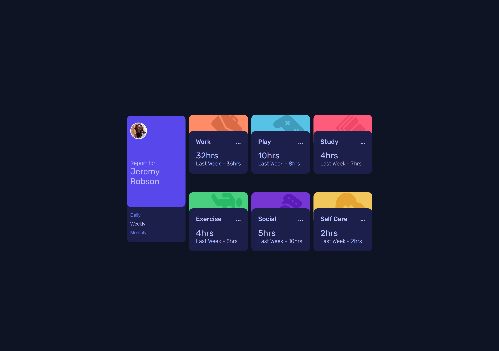
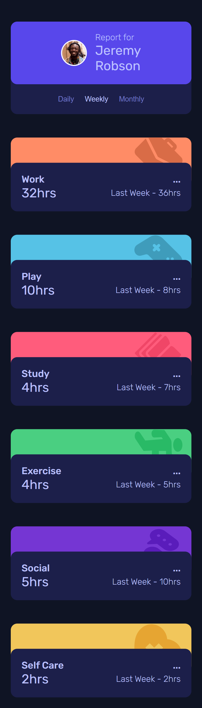

# Frontend Mentor - Time tracking dashboard solution

This is a solution to the [Time tracking dashboard challenge on Frontend Mentor](https://www.frontendmentor.io/challenges/time-tracking-dashboard-UIQ7167Jw). Frontend Mentor challenges help you improve your coding skills by building realistic projects.

## Table of contents

- [Overview](#overview)

  - [The challenge](#the-challenge)
  - [Screenshot](#screenshot)
  - [Links](#links)
  - [Built with](#built-with)
  - [What I learned](#what-i-learned)
  - [Continued development](#continued-development)
  - [Useful resources](#useful-resources)

- [Author](#author)

## Overview

This project is a time tracking dashboard built as part of a Frontend Mentor challenge. The goal was to create it that allows you to switch between viewing Daily, Weekly, and Monthly stats. It adapts seamlessly to different screen sizes, ensuring a consistent user experience on both desktop and mobile devices. The implementation emphasizes semantic HTML and modern CSS which gave me an opportunity to practice CSS Grid.

### The challenge

Users should be able to:

- View the optimal layout for the site depending on their device's screen size
- See hover states for all interactive elements on the page
- Switch between viewing Daily, Weekly, and Monthly stats

### Screenshot




### Links

- Solution URL: [Add solution URL here](https://github.com/remainhumble/Time-tracking-dashboard)
- Live Site URL: [Add live site URL here](https://remainhumble.github.io/Time-tracking-dashboard/)

### Built with

- Semantic HTML5 markup
- CSS custom properties
- Flexbox
- CSS Grid
- Mobile-first workflow
- JavaScript

### What I learned

Throughout this project, I deepened my understanding of managing and displaying dynamic data in a dashboard UI. I learned how to structure data for different timeframes (daily, weekly, monthly) and update the UI efficiently based on user interaction.
Working with semantic HTML and accessibility best practices was another key takeaway. For example, using `<button>` elements for interactive controls and ensuring proper labeling:

Overall, this project helped me reinforce concepts around data-driven UI updates, responsive design, and semantic markup.

```js
const titleName = document.querySelectorAll(".title");

let data = [];

// Fetch data once
fetch("data.json")
  .then((response) => response.json())
  .then((json) => {
    data = json;

    // Set titles
    titleName.forEach((element, index) => {
      element.textContent = data[index].title;
    });
  })
  .catch((error) => {
    console.error("Error fetching data:", error);
  });
```

### Continued development

In future projects, I want to continue improving my skills in the following areas:

- **Advanced state management:** Exploring more robust solutions for handling complex UI states, especially as projects scale.
- **Accessibility:** Deepening my understanding of ARIA roles and keyboard navigation to ensure all users have a seamless experience.
- **Performance optimization:** Learning best practices for optimizing load times and responsiveness, particularly for data-driven dashboards.
- **Reusable components:** Refining my approach to building modular, reusable UI components for consistency and efficiency.

These are areas I plan to focus on and refine as I take on new challenges.

### Useful resources

- [Grid By Example](https://gridbyexample.com/) - Rachel Andrew has created an extremely comprehensive CSS Grid resource. It includes examples, patterns, and tutorials and is a great resource to bookmark and refer to repeatedly.
- [Learn JSON files in 10 minutes! 📄](https://www.youtube.com/watch?v=r4MLHHLctKw&t=424s) - Familiarising myself with JSON from an outstanding coding YouTuber, Bro Code.

## Author

- Frontend Mentor - [@remainhumble](https://www.frontendmentor.io/profile/remainhumble)
- X(formerly Twitter) - [@thiflan120699](https://x.com/thiflan120699)

